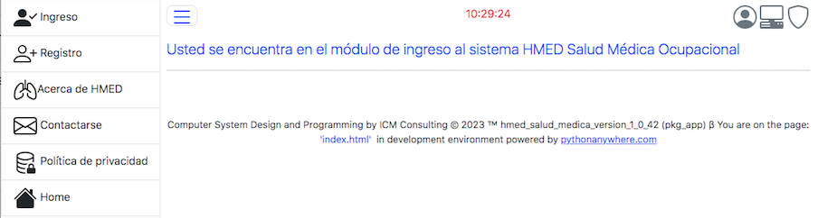

Portal HMED
***********

HMED es un sistema programado para ejecutarse en la nube. En Internet, HMED
es un portal, que concretamente es un sitio web que ofrece al usuario,
De forma fácil e integrada, acceso a una serie de recursos y servicios
relacionados con la medicina ocupacional.

Utilice las opciones del portal para: ingresar al sistema si ya es usuario
registrado, si aún no es un usuario registrado, utilice la opción de registro para
registrar un usuario, para conocer más sobre el sistema utilice la opción
acerca de HMED; si desea ponerse en contacto con el proveedor del sistema utilice
la opción de contacto. Para obtener información sobre la política de privacidad
del sistema utilize la opción de política de privacidad.